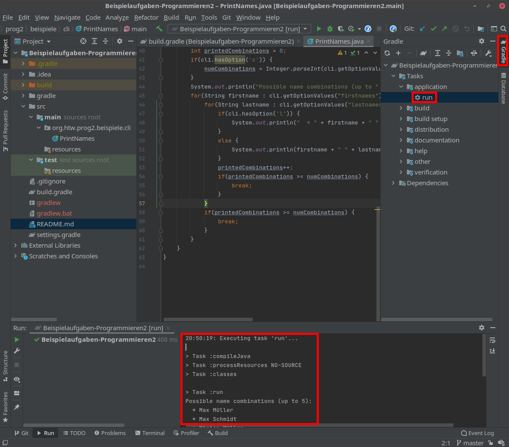
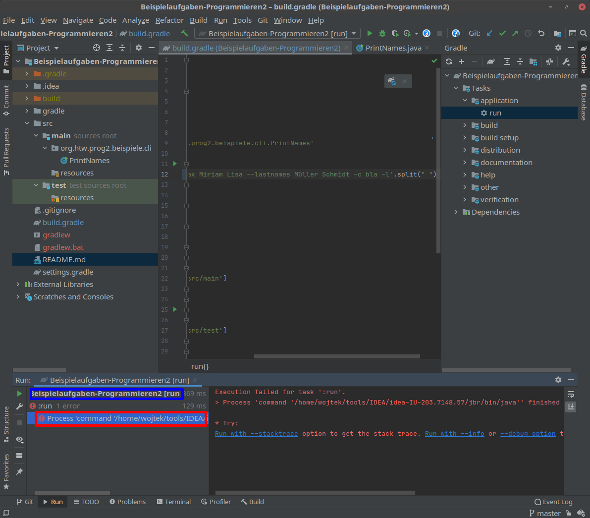

# Aufgabe zu Woche 2

Willkommen bei Programmieren 2! Das hier ist die erste Aufgabe zum Aufwärmen. Forken Sie bitte das Aufgaben-Repository, lesen Sie  die JavaDoc zum Test für ```calculateBabylonianRoot``` in ```MyProjectTest.java``` sowie für die Methode ```calculateBabylonianRoot``` in ```MyProject.java``` durch und implementieren Sie ```calculateBabylonianRoot``` entsprechend. 

Es ist in dem Projekt in build.gradle bereits eine Laufkonfiguration definiert, mit der Sie direkt über gradle das Projekt starten können. Relevant ist dafür die Zeile ```id 'application'```) im plugins-Bereich sowie dies Zeile:

```
mainClassName = 'org.htw.prog2.aufgabe0.MyProject'
```

Um den gradle-Task zum Ausführen zu starten, wählen Sie auf der rechten Seite "Gradle" aus, dann Rechtsklick auf Tasks->application->run und die erste Option ("Run as") auswählen. Unten sehen Sie dann den output (rot eingerahmte Bereiche in der Abbildung):



Beachten Sie bitte: Falls es einen Fehler gibt, sehen Sie diesen nicht direkt im gradle-output, da standardmäßig die gradle-Details (und nicht die Informationen der Programmausführung) ausgewählt sind. Um die Exception aus Ihrem Code zu sehen, klicken Sie unten links auf den blau umrandeten Bereich statt auf den standardmäßig ausgewählten rot umrandeten Bereich:



Sie können auch die Tests direkt ausführen, indem Sie auf die gleiche Art den Task Tasks->verification->test ausführen. 
Viel Erfolg!
